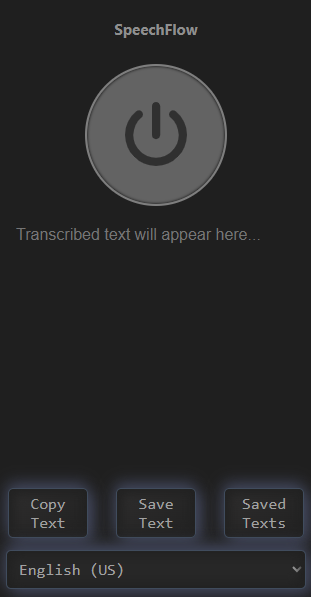
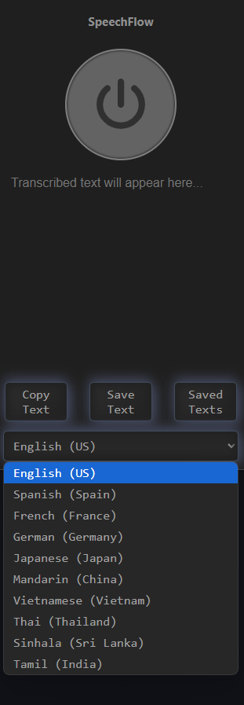

# SpeechFlow Chrome Extension

A simple Web extension that transcribes speech to text in real-time.

## Features

- Start and stop transcription with a button click.
- Uses `getUserMedia()` for microphone access.
- Displays transcribed text in real-time.
- user can save transcribed texts or copy to clipboard.
- allow user to remove saved texts.

## Installation

1. Clone or download this repository.
2. Open **Chrome** or (other prefferd broweser) and navigate to `chrome://extensions/` (command for chrome).
3. Enable **Developer mode** (top-right corner in chrome).
4. Click **Load unpacked** and select the folder containing the extension files.
5. The extension will now appear in the Chrome toolbar.
6. Fisrt time trying to trying to tanscribing will redirect to temporary webpage to grant microphone permission. click **Allow** on it.

## Usage

1. Click on the extension icon to open.
2. Click on **start/stop button** to begin/stop.
3. Speak into your microphone, and the transcribed text will appear.
4. Click on **Copy Text** button to copy satnscribed texts to clipboard
5. Click on **Save Text** button to save transcribed texts and Click on **Saved Texts** button to view them.

## Files Overview

- `manifest.json` - Chrome extension manifest file.
- `popup.html` - The extension's popup UI.
- `popup.js` - JavaScript logic for handling speech recognition.
- `background.js` - Background script for additional functionality.

## Permissions

The extension requires the following permissions:

- `storage` - To store user's transcribed texts.
- `microphone` - To capture audio.

## Troubleshooting

### Extension Not Working?

- Ensure the extension has microphone permissions in Chrome (`chrome://settings/content/microphone`).
- Reload the extension from `chrome://extensions/`.
- Check `chrome://flags/` and enable **Experimental Web Platform features**.
- Restart Chrome and try again.

## Screenshots

## Contributing

Pull requests are welcome! If you find any issues or have suggestions, feel free to open an issue.

## License

This project is open-source and available under the [MIT License](LICENSE).

